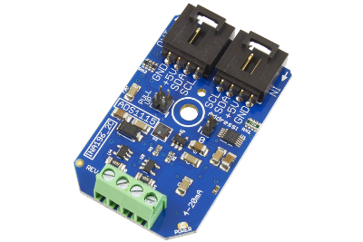

# ADS1115

### Overview

This library provides a class for the ADS1115, it relies on the ncd-red-comm library for communication, and includes a node-red node for the ADS1115. The ADS1115 is a 4-channel, precision, low-power, 16-bit, I2C compatible, analog-to-digital converters. [Ncd.io](https://ncd.io) manufactures a few different mini-modules that utilize this chip for different applications, you can see a [list here](https://store.ncd.io/?post_type=product&fwp_chip_name=ads1115).

This library *should* work with the ADS1113 and ADS1114 chipsets as well, but it has not been tested.

[](https://store.ncd.io/?post_type=product&fwp_chip_name=ads1115)

### Installation

This library can be installed with npm with the following command:

```
npm install ncd-red-ads1115
```

For use in node-red, use the same command, but inside of your node-red directory (usually `~./node-red`).

### Usage

The `test.js` file included in this library contains basic examples for use. The [datasheet](http://www.ti.com/lit/ds/symlink/ads1115.pdf) contains more information on specific settings. All of the available configurations are available in the node-red node through the UI.

### Raspberry Pi Notes

If you intend to use this on the Raspberry Pi, you must ensure that:
1. I2C is enabled (there are plenty of tutorials on this that differ based on the Pi version.)
2. Node, NPM, and Node-red should be updated to the LTS versions. If you skip this step the ncd-red-comm dependency may not load properly.
